# Causal Agent Bench — Full Current Project Audit

**Audit date:** 2026-06-04 (UTC)  
**Auditor role:** Senior project auditor / benchmark reviewer / reproducibility engineer (static, no-run)  
**Repository:** `/Users/saketmaganti/codexprojects/causal-agent-bench`  
**Primary evidence bundle:** `/tmp/cab_godtier_paper_readiness` (from `all-no-run-reports`, post-calibration) and `/tmp/cab_godtier_blocker_cleanup` (leakage calibration)  
**Companion status files:** `MASTER_STATUS.md` (2026-05-31), `PROJECT_STATUS.md` (2026-05-31), `reports/` (2026-05-20)

---

## 1. Executive Summary

**CausalAgentBench** is a Python research package for evaluating tool-using LLM agents under **controlled causal interventions**. Each task has a **clean** instance and one or more **intervention** variants that perturb planning, tools, memory, observations, recovery, or stopping—so that final task success alone is insufficient to infer agent skill.

### Current maturity

| Label                                 | Accurate?                |
| ------------------------------------- | ------------------------ |
| Scaffold only                         | No — far beyond scaffold |
| Benchmark infrastructure              | **Yes — primary state**  |
| Empirical benchmark (provider-backed) | **No — not proven**      |
| Empirical paper                       | **No — not ready**       |
| Public release artifact               | **No — blocked**         |

The project is a **serious benchmark/research scaffold** with strong infrastructure, safety governance, dataset generation, simulated tools, runners, metrics (including ACRS), claim ledger, paper scaffolding, and extensive no-run reporting. It is **not empirically paper-ready**: there are **zero paper-eligible provider-backed runs**, **zero eligible empirical paper assets**, **no human-validation annotations**, and **no supported empirical claims (C1–C8, C10)**.

### What is strong

- Large, typed codebase (~159 Python modules) with rich CLI (80+ subcommands)
- Deterministic generation for pilot and main candidate datasets
- Evidence-level policy, claim ledger, export guards, and `check_evidence_safety.py`
- Frozen pilot dataset (`data/frozen/pilot_v0.1`, 1500 instances)
- Intervention taxonomy (10 types), isolation heuristics, tool-schema validation (0 blockers)
- Provider-pilot templates with explicit budget caps and `allow_paid_calls: false` defaults
- Comprehensive no-run report bundle (45 JSON + 49 Markdown reports in latest audit)
- Advisor/handoff packages, artifact reproduction scripts, CI fast-check design

### What is weak

- **0 true answer-leakage blocker clusters** after webshadow docs-hub repair (2026-06-04); instruction-parameter overlap remains non-blocking
- **No approved provider config** (`configs/*APPROVED`* absent)
- **Stale run index** (36 indexed vs 60 on disk)
- **main_200 / main_v0_1_500** marked `main_candidate_not_ready` in benchmark quality
- 507 gold-output warnings (`tool_removal` answer-changing without gold change)
- 750+ high-risk interventions per dataset flagged for human review before causal claims
- Dirty git tree; no dependency lockfile

### Readiness (honest)

| Gate                        | Ready?                                                  |
| --------------------------- | ------------------------------------------------------- |
| Provider dry-run (template) | **No** — preflight: `ready_for_dry_run: False`          |
| Live provider pilot         | **No** — leakage + no APPROVED config + approvals false |
| Paper submission            | **No**                                                  |
| Public release              | **No**                                                  |

### Most important next action

**Advisor review for provider pilot:** leakage repair complete for known true blockers; rerun `all-no-run-reports`, complete approval forms, then create `provider_pilot_tiny_APPROVED.yaml` (not in repo until signed).

---

## 2. Current Verdict

| Area                         | Verdict                                               | Notes                                                                 |
| ---------------------------- | ----------------------------------------------------- | --------------------------------------------------------------------- |
| Repo/infrastructure maturity | **Strong (8/10)**                                     | Phases 2–9 complete; CLI, tests, CI, docs, safety layer               |
| Dataset/benchmark maturity   | **Mixed (6/10)**                                      | Pilot frozen + generated; leakage blockers; main candidates not ready |
| Evidence maturity            | **Minimal (2/10)**                                    | 60 engineering runs; 0 provider/main scientific runs                  |
| Paper maturity               | **Method-only (3/10)**                                | Draft + placeholders; 4 sections blocked for results                  |
| Provider-pilot readiness     | **Blocked (3/10)**                                    | Template exists; leakage + no approval                                |
| Release readiness            | **Blocked (4/10)**                                    | Docs/licenses OK; no eligible artifacts; dirty tree                   |
| Overall project status       | **Build-infrastructure-ready, empirically not ready** | `build_infrastructure_ready` per README/MASTER_STATUS                 |

### Safety answers

| Question                         | Answer                                                          |
| -------------------------------- | --------------------------------------------------------------- |
| Safe to run provider dry-run?    | **No** (template not approved; leakage gate; preflight blocked) |
| Safe to run live provider pilot? | **No**                                                          |
| Safe to promote claims?          | **No**                                                          |
| Safe to submit paper?            | **No**                                                          |
| Safe to public release?          | **No**                                                          |

---

## 3. What The Project Is

### Benchmark purpose

Measure whether agents exhibit **robust, interpretable competence** across tool-using workflows—not merely whether they produce a correct final answer on clean tasks.

### Clean / intervention design

- **Clean instance:** baseline task with intact tools, memory, and observations.
- **Intervention instance:** same base task with a **single targeted perturbation** (e.g., `tool_failure`, `memory_corruption`, `observation_conflict`, `premature_success_signal`).
- Pairs enable **paired analysis**: clean success vs intervention degradation, ACRS, trajectory diagnostics.

### What causal interventions mean here

Interventions are **controlled synthetic perturbations** to the environment/instruction/tool layer—not live A/B experiments in production. Construct validity requires isolation (one factor changed) and human/expert review for high-risk types (`long_horizon_dependency`, etc.).

### Agent skills measured

Planning, tool selection, argument correctness, observation use, memory, contradiction handling, recovery after failure, stopping discipline, final-answer quality—via paired metrics and trajectory-level scoring.

### Why final success alone is not enough

An agent can succeed on clean tasks while failing under interventions that expose hidden weaknesses (C1–C2). Trajectory metrics can disagree with final-answer scoring (C3). Rankings by clean success can diverge from ACRS (C4).

### Potential value

If executed with clean splits, provider evidence, and human validation, this benchmark could become a **flagship causal agent evaluation** distinguishing robust skill from brittle success—addressing a real gap in agent benchmarks.

---

## 4. Repository Inventory

### Counts (2026-06-04 static scan)

| Item                                        | Count          |
| ------------------------------------------- | -------------- |
| Python modules (`src/causal_agent_bench`)   | 159            |
| Test files (`tests/`)                       | 101            |
| YAML configs (`configs/`)                   | 75             |
| Markdown docs (repo-wide, excl. `results/`) | 272            |
| Scripts (`scripts/`)                        | 83             |
| Processed dataset dirs (`data/processed/`)  | 5              |
| Frozen dataset dirs (`data/frozen/`)        | 1              |
| Live result directories (`results/`*)       | 62             |
| Indexed runs (`results/RUN_INDEX.jsonl`)    | 36 (**stale**) |
| Paper assets scanned (tables/figures)       | 74             |
| JSON reports (latest no-run bundle)         | 45             |
| Markdown reports (latest no-run bundle)     | 49             |

### Directory map

| Path                      | Purpose                                                                                            |
| ------------------------- | -------------------------------------------------------------------------------------------------- |
| `src/causal_agent_bench/` | Core package: CLI, schemas, generation, agents, tools, runners, metrics, analysis, safety, release |
| `configs/`                | Run/generation configs (75 YAML); provider templates; commercial API; mock/stub                    |
| `data/`                   | Sample, processed, frozen datasets; human_validation templates                                     |
| `results/`                | Timestamped run artifacts; `RUN_INDEX.jsonl`                                                       |
| `docs/`                   | Policies, CLI ref, evidence levels, provider pilot packets                                         |
| `paper/`                  | LaTeX draft, evidence gap map, method figures                                                      |
| `tests/`                  | Pytest suite (101 files); unsafe markers for integration/runs                                      |
| `scripts/`                | Status generators, audits, evidence checks, reproduction                                           |
| `reports/`                | Committed safety reports (May 2026); INDEX.md                                                      |
| `release/`                | Release manifest, reproducibility planning                                                         |
| `artifact/`               | Reviewer reproduction scripts (deterministic path)                                                 |
| `figures/`                | Paper figure assets (mostly placeholders/engineering)                                              |
| `tables/`                 | Paper tables (mostly engineering/placeholder)                                                      |
| `benchmark_specs/`        | Task template registry                                                                             |
| `handoff/`                | Advisor review bundles                                                                             |
| `audits/`                 | Build-phase and verification audit archives                                                        |
| `experiments/`            | Freeze checklists, safe decision trees                                                             |

---

## 5. Architecture Overview

| Module area       | Role                                                          | Key paths                                     |
| ----------------- | ------------------------------------------------------------- | --------------------------------------------- |
| **CLI**           | 80+ commands: validate, generate, run, audits, safety reports | `cli.py`, `cli_parsers.py`                    |
| **Schemas**       | Pydantic models for tasks, instances, trajectories, scores    | `schemas.py`, `validation.py`                 |
| **Generation**    | Base tasks, interventions, instances, quality checks          | `generation/`                                 |
| **Agents**        | Direct/ReAct LLM agents, mock diagnostic, oracle, stub        | `agents/`                                     |
| **Tools**         | Simulated + web snapshot tools                                | `tools/simulated.py`, `tools/web_snapshot.py` |
| **Environment**   | Local deterministic execution                                 | `environment.py`                              |
| **Runners**       | Experiment loop, resume, costing, batch, index                | `runners/`                                    |
| **Metrics**       | Scoring, ACRS, recovery, v2 metrics                           | `metrics/`, `scoring.py`                      |
| **Analysis**      | Tables, figures, leaderboard, paper fill, LLM judge           | `analysis/`                                   |
| **Safety**        | Run health, claims, leakage, benchmark quality, dashboards    | `safety/`                                     |
| **Claim ledger**  | C1–C10 status and evidence paths                              | `claim_ledger.py`, `docs/claim_ledger.json`   |
| **Release**       | Manifest, repro bundle, env capture                           | `release/`                                    |
| **Contamination** | Template/canary/duplicate audits                              | `contamination/`                              |
| **Audit**         | Intervention isolation heuristics                             | `audit/intervention_isolation.py`             |
| **Paper**         | Asset export, fill guards                                     | `analysis/paper_assets.py`, `paper/`          |

---

## 6. What Has Been Built

### Package and CLI

- Installable package (`pyproject.toml`, Python 3.11+)
- Full CLI with run management, costing, dry-run, batch, human-validation export, claim updates (guarded), `all-no-run-reports`, `all-safety-reports`

### Schemas and validation

- JSONL schemas for base_tasks, interventions, instances
- `validate-config`, dataset `audit-dataset`, `validate-gold-outputs`, `validate-tool-schemas`

### Data generation

- Configs: `generate_pilot_v0_1.yaml`, `generate_main_v0_1_500.yaml`, mini-study, web-shadow
- Outputs: base_tasks, interventions, instances, splits, generation_report, quality_report

### Datasets

- `dev_20`, `main_200`, `pilot_v0_1`, `main_v0_1_500`, `web_shadow_25`
- Frozen: `data/frozen/pilot_v0.1` (250 base tasks → 1500 instances)

### Simulated tools

- Email, calendar, files, booking stubs—no live web by default

### Agents and baselines

- `direct_tool_agent`, ReAct variants, `local_stub`, mock diagnostic agents, scripted oracle
- Provider clients: OpenAI, Anthropic, Gemini, OpenRouter, OpenAI-compatible, local_openai

### Runner

- Config hash, resume, limits, auto_score, metadata, evidence_scope labeling
- `plan-run`, `estimate-cost`, `estimate-run-cost`, `index-runs`, `run-status`, `mark-interrupted`

### Scoring and metrics

- Instance scoring, aggregate tables, ACRS, trajectory diagnostics, failure galleries

### Analysis

- Export tables/figures, leaderboard, ablation matrix, mini-study/web-shadow comparators
- Paper asset export with eligibility metadata

### Evidence guardrails

- `docs/EVIDENCE_LEVEL_POLICY.md`, `DO_NOT_OVERCLAIM.md`
- `scripts/check_evidence_safety.py`, claim-evidence matrix, paper asset eligibility
- Export guards blocking promotion from engineering runs

### Leakage repair workflow

- `static-leakage-check`, `leakage-repair-plan`, `manual-repair-preview`, `reviewed-ops-template`
- `leakage-suppression-registry`, `apply-leakage-patch` (preview-only safe use)
- **0 auto-patch operations** — all 345 repair clusters are manual-review

### Provider-pilot readiness

- `configs/provider_pilot_tiny_template.yaml` with caps, approvals block, `allow_paid_calls: false`
- `provider-pilot-preflight`, `harden-provider-pilot-config`, post-run checklists in docs

### Paper and release scaffolding

- LaTeX paper draft, placeholder protection, method appendix generator
- `release/release_manifest.json`, artifact README, reproducibility manifest generator

### Human validation scaffolding

- Protocol docs, annotation CSV/schema templates, dry-run sample packet (no real annotations)

### No-run reports and dashboards

- `all-no-run-reports`: 40+ report types including war room, governance OS, evidence dashboard
- Committed `reports/` subset (run health, claims, paper assets, TODOs)

### Tests and docs

- 101 test files; markers for integration/local_run unsafe tests
- Extensive docs/, handoff/, audits/, MASTER_STATUS, PROJECT_HEALTH

---

## 7. What Is Not Yet Built or Not Yet Proven

| Item                                             | Status                                     |
| ------------------------------------------------ | ------------------------------------------ |
| Completed provider-backed pilot (non-oracle)     | **Missing**                                |
| Paper-eligible runs                              | **0**                                      |
| Eligible empirical paper assets                  | **0** (74 scanned, 74 flagged)             |
| Human validation annotations                     | **Missing**                                |
| Main 500 multi-provider benchmark                | **Not run**                                |
| Supported empirical claims C1–C8, C10            | **All planned** (C9 engineering_only only) |
| Final results tables/figures with real numbers   | **Placeholders / engineering**             |
| Public release readiness                         | **Blocked**                                |
| Empirical paper readiness                        | **Blocked**                                |
| Clean dataset release (leakage-free, signed-off) | **Not achieved**                           |
| Approved provider config copy                    | **Missing**                                |

---

## 8. Data and Dataset Status

### Dataset table

| Dataset path                                | Base tasks | Interventions   | Instances                  | Status                                                                 |
| ------------------------------------------- | ---------- | --------------- | -------------------------- | ---------------------------------------------------------------------- |
| `data/sample`                               | small      | —               | few                        | Sample/dev only                                                        |
| `data/processed/dev_20`                     | 20         | —               | 80                         | Dev; missing split metadata warning                                    |
| `data/processed/pilot_v0_1` (20-task slice) | 20         | 1250 (full gen) | 120 (`pilot_20_instances`) | **Provider pilot path**; processed                                     |
| `data/frozen/pilot_v0.1`                    | 250        | —               | 1500                       | **Frozen pilot**; heldout present; release quality 70                  |
| `data/processed/main_200`                   | 200        | —               | 1200                       | **Blocker:** `main_candidate_not_ready`                                |
| `data/processed/main_v0_1_500`              | 500        | —               | 3000                       | **Blocker:** `main_candidate_not_ready`; missing heldout split warning |
| `data/processed/web_shadow_25`              | 25         | —               | ~125                       | Optional study; leakage in webshadow clusters                          |

### Leakage state (static, 2026-06-04)

- **0 true blocker clusters** — webshadow docs-hub leak repaired; re-run `all-no-run-reports` to confirm
- **Instruction-parameter overlap** — task dates/times in prompts; calibrated as non-blocking
- **128 needs_manual_review** clusters (heldout/pilot overlap, etc.)
- **11 false-positive candidate** clusters (clean/intervention similarity — expected for paired design)
- **0** active suppression entries (registry empty)

### Pilot vs main readiness

- **Pilot (`frozen/pilot_v0.1`):** static provider-pilot quality score **95** — structural gate passes, but **leakage blockers override execution**
- **Main (`main_200`, `main_v0_1_500`):** `main_candidate_not_ready` — do not use for provider pilot or main claims yet

### Dataset safety classification

| Category                             | Paths                                                                                    |
| ------------------------------------ | ---------------------------------------------------------------------------------------- |
| Safe for static review               | All processed + frozen (read-only audits)                                                |
| Blocked for provider pilot (leakage) | Instances with answer in prompt (6 clusters); review `manual_repair_preview.md`          |
| Blocked for main benchmark           | `main_200`, `main_v0_1_500` until candidate-ready + leakage review                       |
| Needs manual repair                  | Answer-leakage clusters; split metadata (10 clusters); 50 manual-review leakage clusters |

---

## 9. Config Status

### Profile summary (75 configs scanned)

| Profile                 | Count |
| ----------------------- | ----- |
| mock_diagnostic         | 36    |
| provider_pilot_template | 8     |
| unknown_needs_review    | 16    |
| local_preliminary       | 7     |
| commercial_api          | 3     |
| ablation                | 2     |
| smoke_engineering       | 2     |
| oracle_sanity           | 1     |

### Provider pilot template (`configs/provider_pilot_tiny_template.yaml`)

| Field                            | Value                                                                         |
| -------------------------------- | ----------------------------------------------------------------------------- |
| `allow_paid_calls`               | **false**                                                                     |
| `scientific_evidence_level`      | `preliminary_or_engineering`                                                  |
| `evidence_scope`                 | `provider_pilot_pending_verification`                                         |
| `approval.advisor_approved`      | **false**                                                                     |
| `approval.budget_approved`       | **false**                                                                     |
| `approval.approved_for_dry_run`  | **false**                                                                     |
| `approval.approved_for_live_run` | **false**                                                                     |
| `max_instances` / trajectories   | 5                                                                             |
| `budget.max_total_usd`           | 5.0                                                                           |
| Benchmark path                   | `data/processed/pilot_v0_1/pilot_20_instances.jsonl` (120 lines; capped to 5) |
| Approved copy                    | **None** (`configs/*APPROVED`* absent)                                        |

**validate-config:** `valid: true`, `ready_to_run: false` (allow_paid_calls error for commercial path)  
**plan-run:** 5 trajectories, ~150s estimated, `safe_to_run_now: True` (planning only—not execution approval)  
**estimate-run-cost:** high bound ~$0.24 for 5 traj; `runnable_without_approval: false`

### Config risk classes

| Class             | Examples                                                    | Safe to run now?                       | Paper claims?            |
| ----------------- | ----------------------------------------------------------- | -------------------------------------- | ------------------------ |
| Mock diagnostic   | `pilot_mock_diagnostic_micro.yaml`                          | Engineering only if explicitly desired | No                       |
| Stub/smoke        | `smoke.yaml`, `pilot_stub_micro_3.yaml`                     | Pipeline check only                    | No                       |
| Local preliminary | `pilot_free_local_20.yaml`                                  | Long runtime; interrupted history      | No                       |
| Oracle sanity     | `provider_pilot_oracle_sanity_check_template.yaml`          | Oracle only                            | No                       |
| Provider template | `provider_pilot_tiny_template.yaml`, `pilot_openai_20.yaml` | **No live run**                        | No until post-run review |
| Commercial API    | `commercial_api_main_500.yaml`                              | **Forbidden without approval**         | No                       |
| Main benchmark    | `main_500_multi_provider.yaml`                              | **Not now**                            | No                       |

---

## 10. Current Evidence State

### Run inventory

| Metric                       | Value                                                 |
| ---------------------------- | ----------------------------------------------------- |
| Live result directories      | 60                                                    |
| Indexed in `RUN_INDEX.jsonl` | 36 (**stale**, 24 un-indexed)                         |
| Paper-eligible runs (strict) | **0**                                                 |
| Provider pilot runs          | **0**                                                 |
| Mock diagnostic (indexed)    | 2                                                     |
| Stub/smoke engineering       | 30+ (many un-indexed smokes)                          |
| Interrupted local runs       | 2 (`pilot_free_local_20`, `pilot_free_local_fast_10`) |
| Complete engineering-only    | 2                                                     |

**RUN_INDEX stale:** Safe fix is `python3 -m causal_agent_bench index-runs` (inventory only; **does not** change eligibility). Evidence safety scan: 60 live dirs, notes stale index.

### Claims (C1–C10)

| Claim | Status               | Evidence                                    |
| ----- | -------------------- | ------------------------------------------- |
| C1–C8 | **planned**          | Requires provider/main runs + analysis      |
| C9    | **engineering_only** | CI/smoke reproducibility — not LLM behavior |
| C10   | **planned**          | Requires human expert validation            |

**Supported empirical claims:** **0**

### What counts as evidence

| Type                            | Usable for                                                        |
| ------------------------------- | ----------------------------------------------------------------- |
| Stub/smoke/mock runs            | Pipeline wiring, C9 engineering boundary                          |
| Interrupted local runs          | Debugging only — not scientific                                   |
| No-run reports                  | Governance, blockers, repair planning — **not empirical results** |
| Static benchmark quality scores | Dataset structure — **not model performance**                     |

### What cannot enter the paper

- Any table2–6 performance numbers from existing runs
- Rankings, κ, ρ, [N]/[M]/[K] placeholders filled from mock/stub
- Assets flagged `engineering_only`, `placeholder`, `missing_metadata`

---

## 11. Paper Asset State

**Scan (2026-06-04):** 74 assets — **0 eligible**, **74 flagged**

| Classification     | Implication                          |
| ------------------ | ------------------------------------ |
| `engineering_only` | Appendix/engineering validation only |
| `placeholder`      | Must not use in submission           |
| `missing_metadata` | Needs `.meta.json` sidecar review    |

**Method-only safe:** benchmark design figures, pipeline diagrams, metric definitions (per paper readiness map)  
**Blocked from results:** table2–5, figure2–6 performance plots until eligible runs exist

---

## 12. Claim and Paper Guardrail Status

### Claim requirements (summary)

| Claim | Requires                                                             |
| ----- | -------------------------------------------------------------------- |
| C1    | Paired clean vs intervention runs, multiple non-oracle agents, CIs   |
| C2    | Family-balanced benchmark, tool_failure + memory_corruption evidence |
| C3    | Human validation + trajectory/final disagreement                     |
| C4    | Multi-agent ranking, ACRS vs clean success                           |
| C5–C8 | Specific intervention families + ablations                           |
| C9    | Reproducible smoke/CI (engineering)                                  |
| C10   | Expert annotation of intervention validity                           |

### Promotion safety

- `update-claim-ledger --promote-to-supported` — **unsafe** on real claims now
- `fill-paper-from-run --promote-to-supported` — **unsafe**
- Claim-evidence matrix: conservative; eligible scientific runs = 0

### Paper sections (readiness map)

| Section                                           | Status                                   |
| ------------------------------------------------- | ---------------------------------------- |
| Benchmark design, metrics, limitations            | `ready_method_only`                      |
| Results, experiments, human validation, ablations | **blocked**                              |
| Abstract, introduction, conclusion                | `needs_evidence` (no empirical language) |

---

## 13. Static Leakage and Dataset Repair Status

| Metric                            | Value   |
| --------------------------------- | ------- |
| Datasets scanned                  | 7       |
| Raw findings                      | 210,217 |
| Root-cause clusters               | 345     |
| True blocker clusters (answer leakage) | **0** (webshadow repair; was 6 pre-calibration, ~1 pre-repair) |
| Instruction-parameter overlap (non-blocking) | Calibrated false positives |
| Candidate auto-patches            | **0**   |
| Manual-review operations          | 345     |
| Active suppressions               | 0       |

### Top blocker root causes (provider pilot)

1. `leak_root_cd9fba48c863` — 137 symptoms (calendar/email clean tasks)
2. `leak_root_101b7e29c719` — 42 symptoms (file_qa clean tasks)
3. Four webshadow clusters — 2 symptoms each

### Repair artifacts

| Artifact                     | Status                            |
| ---------------------------- | --------------------------------- |
| `leakage_repair_plan.md`     | Ready — must-fix count from latest `all-no-run-reports` |
| `proposed_patch_manifest.md` | Valid; **0** auto-apply ops       |
| `manual_repair_preview.md`   | Human rewrite instructions        |
| `reviewed_ops_template`      | Blank template for approved ops   |
| Patch applier                | Preview-only until human approval |

### Policy

- **Before provider pilot:** fix true answer-leakage clusters manually (see `answer_leakage_repair.md`)
- **Before main benchmark:** additional heldout/pilot manual-review clusters
- **Never auto-apply:** answer leakage, duplicate IDs, or suppress true blockers
- **False positives:** clean/intervention pair similarity (expected for paired design)

---

## 14. Benchmark Quality Status

| Metric                         | Value                                   |
| ------------------------------ | --------------------------------------- |
| Datasets inspected             | 7                                       |
| Total tasks                    | 1,273                                   |
| Total instances                | 7,589                                   |
| Clean/intervention pairs       | 6,316                                   |
| Overall quality score          | 95                                      |
| Provider-pilot readiness score | 95 (static structure)                   |
| Main benchmark readiness score | 95 (static)                             |
| Release readiness score        | 70                                      |
| Blockers                       | 2 (`main_candidate_not_ready` ×2)       |
| Warnings                       | 3,886 (mostly `high_risk_intervention`) |

**Note:** Static quality gate can read “ready for provider pilot” while **readiness war room** still blocks execution due to **leakage** — treat leakage war room as the binding gate for spend.

### Dataset-specific

- **pilot_v0.1 (frozen):** 250 tasks, 1500 instances, pairs complete, heldout present
- **main_200 / main_v0_1_500:** not ready for pilot/main claims until blockers cleared

---

## 15. Intervention Isolation Status

| Metric                      | Value |
| --------------------------- | ----- |
| Pair records (frozen pilot) | 1,250 |
| Isolated                    | 0     |
| Likely isolated             | 1,250 |
| Multi-factor                | 0     |
| Needs review                | 0     |
| Isolation score             | 90    |
| Blockers                    | 0     |

**Caveat:** Heuristic only—not human expert validation (C10 still planned).

**Risky types flagged in benchmark quality:** `long_horizon_dependency`, `memory_corruption`, etc. — 750 warnings on frozen pilot.

---

## 16. Tool Schema Status

| Metric           | Value |
| ---------------- | ----- |
| Datasets scanned | 7     |
| Issues           | **0** |
| Blockers         | 0     |

**Verdict:** No tool-schema blockers before provider pilot or main benchmark.

---

## 17. Gold Output Status

| Metric   | Value |
| -------- | ----- |
| Issues   | 507   |
| Blockers | 0     |
| Warnings | 507   |

**Primary pattern:** `answer_changing_without_gold_change` on `tool_removal` interventions (mostly frozen pilot).

**Impact:** Scoring/rubric consistency risk—not a hard pilot blocker, but should be triaged before main claims.

---

## 18. Human Validation Status

| Item                        | Status                             |
| --------------------------- | ---------------------------------- |
| Protocol / annotation guide | Present in docs + templates        |
| Template CSV/schema         | `data/human_validation/templates/` |
| Dry-run sample packet       | Generated (no-run)                 |
| **Actual annotations**      | **No**                             |
| **Agreement metrics**       | **No**                             |
| C3 / C10 readiness          | **Blocked**                        |

**Before human-validation claims:** complete provider pilot → export sample → recruit annotators → compute κ/α → adjudication records.

---

## 19. Provider Pilot Gate

| Check                   | Status                                          |
| ----------------------- | ----------------------------------------------- |
| Template exists         | Yes                                             |
| Approved config         | **No**                                          |
| Advisor/budget approval | **false**                                       |
| `allow_paid_calls`      | false                                           |
| Model placeholder       | Unresolved `${OPENAI_MODEL_ID:-PLACEHOLDER...}` |
| Leakage gate            | **Blocked** (6 clusters)                        |
| Preflight gate          | `template_safe_but_not_runnable`                |
| Dry-run ready           | **False**                                       |
| Live-run ready          | **False**                                       |

**Exact next action:** Review `leakage_repair_plan.md` → manual repair → rerun no-run reports → advisor approval → copy template to `provider_pilot_tiny_APPROVED.yaml` → validate → dry-run → live pilot.

---

## 20. Release and Reproducibility Status

| Dimension                             | Status                                                     |
| ------------------------------------- | ---------------------------------------------------------- |
| Internal advisor review               | **Ready** (docs/bundles)                                   |
| Provider pilot execution              | **Not ready**                                              |
| Public release                        | **Not ready** (dirty git, no lockfile, no eligible assets) |
| Empirical paper                       | **Not ready**                                              |
| License / DATA_LICENSE / CITATION.cff | Present                                                    |
| Reproducibility manifest              | Generator exists; no frozen release tag                    |
| Artifact package                      | `artifact/scripts/reproduce_deterministic.sh`              |
| Unsafe tests documented               | Yes (pytest markers)                                       |
| No-run validation docs                | `docs/NO_RUN_VALIDATION.md`                                |

---

## 21. Report Quality and Dashboard Status

| Metric                    | Value                                                            |
| ------------------------- | ---------------------------------------------------------------- |
| JSON reports (bundle)     | 45                                                               |
| Markdown reports (bundle) | 49                                                               |
| Report-quality blockers   | 0                                                                |
| Warnings                  | 9 (mostly missing verdict on governance JSON + stale index note) |

**Dashboard:** `evidence_dashboard/index.md` — actionable; lists leakage blockers and top 10 actions.

**Noise:** Raw leakage symptom counts are huge (210k+); reports cluster to **345 root causes** — use clustered views, not raw floods.

**Actionability:** **High** for war room, next-action plan, leakage repair; **low** for raw symptom lists without clustering.

---

## 22. What Can Be Run Now

See **[docs/COMMAND_AND_RUNTIME_GUIDE.md](docs/COMMAND_AND_RUNTIME_GUIDE.md)** for the advisor-facing command/runtime reference (safe vs unsafe, budget, GPU, claim boundaries).

| Command                                                                  | Purpose                   | Safe now? | Expected time | Starts benchmark? | Provider/API risk? | Cost risk? | Paper claims?     |
| ------------------------------------------------------------------------ | ------------------------- | --------- | ------------- | ----------------- | ------------------ | ---------- | ----------------- |
| `python3 -m causal_agent_bench --help`                                   | CLI discovery             | **Yes**   | <1s           | No                | No                 | No         | No                |
| `python3 scripts/check_evidence_safety.py`                               | Evidence guard scan       | **Yes**   | ~2s           | No                | No                 | No         | No                |
| `python3 -m causal_agent_bench all-no-run-reports --output-dir /tmp/...` | Full static audit bundle  | **Yes**   | ~1–2 min      | No                | No                 | No         | No                |
| `validate-config --config configs/provider_pilot_tiny_template.yaml`     | Config validation         | **Yes**   | ~2s           | No                | No                 | No         | No                |
| `plan-run --config configs/provider_pilot_tiny_template.yaml`            | Trajectory/cost plan      | **Yes**   | ~5s           | No                | No                 | No         | No                |
| `estimate-run-cost` (same config)                                        | Cost bound                | **Yes**   | ~5s           | No                | No                 | Low est.   | No                |
| `dry-run --config configs/pilot_stub_micro_3.yaml`                       | Local simulation          | **Yes**   | ~10–30s       | No                | No                 | No         | No                |
| `audit-dataset` / `static-leakage-check`                                 | Dataset audits            | **Yes**   | ~10–60s       | No                | No                 | No         | No                |
| `index-runs`                                                             | Refresh RUN_INDEX         | **Yes**   | ~5s           | No                | No                 | No         | No                |
| `run-status` / `summarize-run`                                           | Inspect past runs         | **Yes**   | ~2–5s         | No                | No                 | No         | No                |
| `make fast-check`                                                        | Lint/type/tests (no runs) | **Yes***  | ~40–60s       | No*               | No*                | No         | No                |
| `make doctor` / `make audit-repo`                                        | Health audits             | **Yes**   | ~30s–2m       | No                | No                 | No         | No                |
| Targeted fixture pytest                                                  | Unit tests only           | **Yes***  | seconds–min   | No*               | No*                | No         | No                |
| `run --config configs/smoke.yaml`                                        | Smoke benchmark           | **No**†   | ~1–5 min      | **Yes**           | Stub only          | No         | No                |
| `run --config configs/pilot_openai_20.yaml`                              | Provider pilot            | **No**    | 30–120m       | **Yes**           | **Yes**            | **$$**     | No until reviewed |
| `run --config configs/commercial_api_main_500.yaml`                      | Main 500                  | **No**    | 1–3 days      | **Yes**           | **Yes**            | **$$$$**   | No                |
| Local LLM 20 traj                                                        | `pilot_free_local_20`     | **No**‡   | hours         | **Yes**           | Local              | Compute    | No                |

Per project policy: allowed if markers exclude experiment runs; user audit forbade `make test`/`make smoke` in this session.  
†Engineering-only; not forbidden by tooling but **not recommended** in strict no-run audit mode.  
‡History of interrupts; not scientific evidence.

### Runtime planning (approximate)

| Scale                        | Time       | Notes                        |
| ---------------------------- | ---------- | ---------------------------- |
| Tiny provider pilot (5 traj) | 5–30 min   | After approval + leakage fix |
| Provider 20 traj             | 30–120 min | Rate limits vary             |
| Provider 100 traj            | 3–8 h      |                              |
| Main 500                     | 1–3 days   | Parallelism-dependent        |
| Local 3 micro                | 5–30 min   | CPU/GPU dependent            |
| Local 20                     | Hours      | Often interrupted on laptop  |

**GPU:** Not required for provider APIs; local Ollama may benefit from GPU.  
**Bottlenecks:** Rate limits, max_steps, token caps, budget caps.

---

## 23. What Must Not Be Run Yet

| Command / action                            | Why                                               |
| ------------------------------------------- | ------------------------------------------------- |
| `run --config` any provider/commercial YAML | No approval, leakage blockers, no APPROVED config |
| `allow_paid_calls: true` without advisor    | Budget/evidence policy                            |
| `make smoke` / `make test` (broad)          | May trigger runs; forbidden in strict audit       |
| `run-llm-judge`                             | Provider calls                                    |
| `fill-paper-from-run` / claim promotion     | Would overclaim                                   |
| `apply-leakage-patch` (apply mode)          | Without human review                              |
| Main 500 / commercial 100                   | Scale + gates                                     |
| Long local 20-task                          | Non-evidence + interrupt risk                     |

---

## 24. Runtime and Compute Planning

- **Provider runs:** Cloud APIs; no local GPU required; respect `budget.max_total_usd` and trajectory caps.
- **Local LLM:** `LOCAL_OPENAI_BASE_URL` (Ollama); can be slow on MacBook CPU; 2 interrupted runs in index.
- **First spend:** Tiny approved pilot (5 instances) after leakage repair — est. **<$1** per `estimate-run-cost`.
- **Why tiny first:** Validates metadata, scoring, evidence_scope, and post-run safety before 20/100/500 scale.

---

## 25. Current Publication Potential

| Venue tier                             | Ready?  | Gap                                        |
| -------------------------------------- | ------- | ------------------------------------------ |
| arXiv (methods + proposed experiments) | Partial | Method sections OK; must not imply results |
| Workshop short paper                   | Partial | Needs pilot teaser results                 |
| COLM/ACL/EMNLP main                    | **No**  | Full empirical + human val                 |
| NeurIPS/ICML benchmark track           | **No**  | Scale + rigor + release                    |
| TMLR                                   | **No**  | Repro bundle + complete evidence           |

**Honest statement:** Infrastructure could support a **methods/architecture preprint**; **not empirically publishable** until provider pilot + human validation + leakage-clean splits.

---

## 26. Current Project Score

| Category            | Score / 10 | Explanation                                              |
| ------------------- | ---------- | -------------------------------------------------------- |
| Repo infrastructure | **8**      | Mature CLI, tests, CI, safety, docs                      |
| Benchmark design    | **8**      | Strong intervention framework; isolation heuristics good |
| Dataset quality     | **6**      | Large synthetic sets; leakage + main candidate blockers  |
| Evidence maturity   | **2**      | Engineering runs only                                    |
| Paper readiness     | **3**      | Method draft OK; zero eligible assets                    |
| Release readiness   | **4**      | Packaging started; dirty tree, no lockfile               |
| Flagship potential  | **7**      | High if executed; high risk if overclaimed early         |

---

## 27. Top Critical Blockers

### Before provider dry-run

1. **True answer-leakage cluster(s)** — manual prompt rewrite (webshadow + any new true blockers)
2. **No APPROVED config** — copy + advisor/budget flags
3. **Model env vars unset** — placeholder in template

### Before live provider pilot

1. All dry-run blockers above
2. `approved_for_live_run: true` + `allow_paid_calls: true` only after explicit approval
3. Post-repair rerun of `all-no-run-reports` showing leakage blockers cleared

### Before main benchmark

1. `main_candidate_not_ready` on main_200 and main_v0_1_500
2. Heldout/split manual-review clusters
3. High-risk intervention human review (750+ warnings)

### Before paper submission

1. Paper-eligible provider runs
2. Human annotations + agreement (C3, C10)
3. Eligible paper assets with metadata
4. Supported claims C1–C8

### Before public release

1. Clean git state + lockfile
2. Leakage-clean public dataset
3. Repro bundle on release tag

---

## 28. Top 20 Next Actions

| Rank | Action                                     | Why                       | Files / reports                                      | Compute | Time       | Human review? |
| ---- | ------------------------------------------ | ------------------------- | ---------------------------------------------------- | ------- | ---------- | ------------- |
| 1    | Fix true answer-leakage cluster(s)         | Blocks provider pilot     | `answer_leakage_repair.md`, `manual_repair_preview.md` | None    | hours–days | **Yes**       |
| 2    | Rerun `all-no-run-reports` after repair    | Verify gates              | `/tmp/cab_`*                                         | None    | ~2 min     | No            |
| 3    | `index-runs`                               | Fix stale inventory       | `results/RUN_INDEX.jsonl`                            | None    | ~5s        | No            |
| 4    | Advisor review packet                      | Sign-off on scale/budget  | `handoff/`, `advisor_review_packet.md`               | None    | 1 meeting  | **Yes**       |
| 5    | Copy → `provider_pilot_tiny_APPROVED.yaml` | Runnable config           | `configs/provider_pilot_tiny_template.yaml`          | None    | 30 min     | **Yes**       |
| 6    | Set env model IDs + budget approval        | Preflight pass            | `.env.example`                                       | None    | 15 min     | **Yes**       |
| 7    | `validate-config` + `dry-run` on APPROVED  | No-spend gate             | APPROVED config                                      | None    | ~1 min     | No            |
| 8    | `estimate-run-cost` on APPROVED            | Cost bound                | cost_estimate report                                 | None    | ~5s        | **Yes**       |
| 9    | Tiny live provider pilot (5 traj)          | First scientific evidence | APPROVED config                                      | API $   | 5–30 min   | **Yes**       |
| 10   | Post-run evidence audit                    | Eligibility               | `run-health`, `claim-evidence`                       | None    | ~5 min     | **Yes**       |
| 11   | Export human validation sample             | C3/C10 path               | `export-human-validation`                            | None    | ~1 min     | **Yes**       |
| 12   | Recruit annotators                         | Human claims              | `data/human_validation/`                             | None    | weeks      | **Yes**       |
| 13   | Resolve `main_candidate_not_ready`         | Main scale                | `main_200`, `main_v0_1_500`                          | None    | days       | **Yes**       |
| 14   | Triage gold-output warnings                | Scoring integrity         | `gold_output_validation.md`                          | None    | days       | Partial       |
| 15   | Triage high-risk interventions             | C10 validity              | benchmark quality report                             | None    | days       | **Yes**       |
| 16   | Config metadata lint (97 issues)           | Safety caps               | `config_metadata_lint.md`                            | None    | hours      | Partial       |
| 17   | 20-task multi-provider pilot               | C1–C4 evidence            | `pilot_multi_provider_20.yaml`                       | API $$  | 1–2 h      | **Yes**       |
| 18   | Fill paper from verified run only          | Results section           | `fill-paper-from-run` (guarded)                      | None    | hours      | **Yes**       |
| 19   | Commit/clean git for release               | Public trust              | git hygiene                                          | None    | hours      | No            |
| 20   | Plan repro bundle after pilot              | Artifact eval             | `release/`                                           | None    | days       | Partial       |

---

## 29. Recommended Roadmap

```mermaid
flowchart LR
  S0[Stage 0: Commit no-run work] --> S1[Stage 1: Manual leakage repair]
  S1 --> S2[Stage 2: Rerun no-run reports]
  S2 --> S3[Stage 3: Advisor packet]
  S3 --> S4[Stage 4: APPROVED provider config]
  S4 --> S5[Stage 5: validate / estimate / dry-run]
  S5 --> S6[Stage 6: Tiny provider pilot]
  S6 --> S7[Stage 7: Post-run evidence audit]
  S7 --> S8[Stage 8: Human validation]
  S8 --> S9[Stage 9: Small multi-model pilot]
  S9 --> S10[Stage 10: Main benchmark]
  S10 --> S11[Stage 11: Paper finalization]
  S11 --> S12[Stage 12: Release artifact]
```

| Stage  | Goal                                                          |
| ------ | ------------------------------------------------------------- |
| **0**  | Commit/clean current no-run infrastructure (dirty tree today) |
| **1**  | Manual dataset repair (true answer-leakage cluster(s))          |
| **2**  | Rerun `all-no-run-reports`; confirm leakage blockers = 0      |
| **3**  | Advisor review packet + pilot scale decision                  |
| **4**  | `provider_pilot_tiny_APPROVED.yaml` with approvals            |
| **5**  | validate-config → estimate-run-cost → dry-run                 |
| **6**  | Tiny provider pilot (5 trajectories, capped budget)           |
| **7**  | Post-run: run-health, claim-evidence, paper asset eligibility |
| **8**  | Human validation export + annotations                         |
| **9**  | 20-task multi-provider pilot                                  |
| **10** | Main 500 (only after MAIN_EXPERIMENT_GATE)                    |
| **11** | Paper finalization from eligible assets only                  |
| **12** | Release tag + repro bundle + artifact                         |

---

## 30. Final Recommendation

### Primary recommendation

`**start manual dataset repair review`** — then rerun no-run audit — then advisor review — then approved provider config.

Do **not** proceed to live provider pilot until leakage blockers are cleared and an APPROVED config exists.

### Explicit answers

| Question                       | Answer                                                                                     |
| ------------------------------ | ------------------------------------------------------------------------------------------ |
| Is the project done?           | **No** — infrastructure largely done; science not started                                  |
| Is the paper done?             | **No** — method draft only; results blocked                                                |
| Is it ready to run (provider)? | **No**                                                                                     |
| Is it ready to submit?         | **No**                                                                                     |
| What exactly next?             | Open `answer_leakage_repair.md`; fix true blockers; rerun `all-no-run-reports` |

---

## Appendix A — Commands Executed in This Audit

| Command                                                                                                                                                       | Result                              |
| ------------------------------------------------------------------------------------------------------------------------------------------------------------- | ----------------------------------- |
| `python3 scripts/check_evidence_safety.py`                                                                                                                    | OK; 60 live dirs; stale index noted |
| `python3 -m causal_agent_bench --help`                                                                                                                        | OK                                  |
| `python3 -m causal_agent_bench all-no-run-reports --output-dir /tmp/cab_current_status_audit`                                                                 | OK (~87s)                           |
| `python3 -m causal_agent_bench validate-config --config configs/provider_pilot_tiny_template.yaml`                                                            | valid; ready_to_run false           |
| `python3 -m causal_agent_bench plan-run --config configs/provider_pilot_tiny_template.yaml`                                                                   | OK                                  |
| `python3 -m causal_agent_bench estimate-run-cost --config configs/provider_pilot_tiny_template.yaml --output-dir /tmp/cab_current_status_audit/cost_estimate` | OK; ~$0.24 high bound               |

## Appendix B — Commands Not Executed (per audit rules)

- `make smoke`, `make test`, broad pytest
- `python3 -m causal_agent_bench run --config ...`
- Provider API calls, local LLM runs
- `run-llm-judge`, claim promotion, `fill-paper-from-run --promote-to-supported`
- `index-runs` (recommended but not run—to avoid mutating `results/` index during audit)

## Appendix C — Key report paths

| Report                   | Path                                                                     |
| ------------------------ | ------------------------------------------------------------------------ |
| Latest full bundle       | `/tmp/cab_current_status_audit/`                                         |
| Committed safety reports | `reports/INDEX.md`                                                       |
| War room                 | `/tmp/cab_current_status_audit/readiness_war_room/readiness_war_room.md` |
| Evidence dashboard       | `/tmp/cab_current_status_audit/evidence_dashboard/index.md`              |
| Next actions             | `/tmp/cab_current_status_audit/next_action_plan/next_action_plan.md`     |

---

*End of audit dossier. This document is the single source of truth for project state as of 2026-06-04 static inspection.*