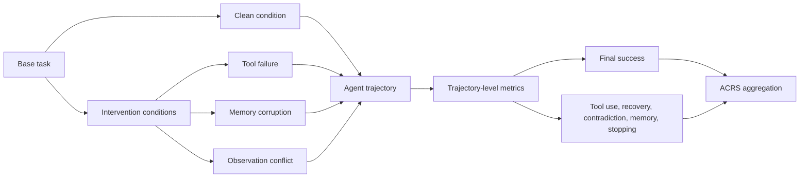

# Figure 1: Benchmark Schematic

```mermaid
flowchart LR
  A["Base task"] --> B["Clean condition"]
  A --> C["Intervention conditions"]
  C --> C1["Tool failure"]
  C --> C2["Memory corruption"]
  C --> C3["Observation conflict"]
  B --> D["Agent trajectory"]
  C1 --> D
  C2 --> D
  C3 --> D
  D --> E["Trajectory-level metrics"]
  E --> F["Final success"]
  E --> G["Tool use, recovery, contradiction, memory, stopping"]
  F --> H["ACRS aggregation"]
  G --> H
```

This is a schematic template. Replace with a designed figure after the benchmark design is frozen.
