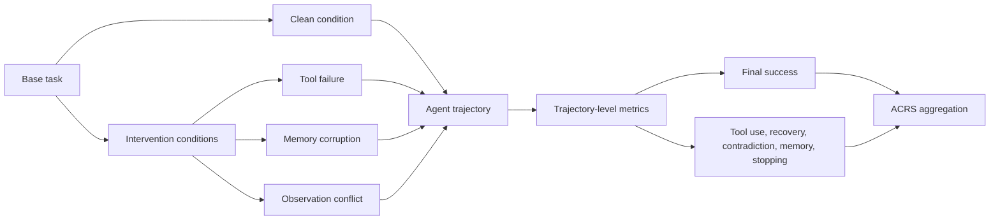

# Figure 1: Benchmark Schematic

This is a schematic template. Replace with a designed figure after the benchmark design is frozen.

## Asset Metadata

- run_dir: `results/20260511T162146Z_pilot_20_multi_agent_stub`
- config_hash: `6c0a1da78f8a8f53`
- seed: `20270511`
- dataset_version: `unknown`
- model_ids: `local-stub`
- scorer_versions: `deterministic_heuristic_v1`
- git_commit: `dea8e25f0e429ed2054c628fb37d24e7c1c9020e`
- timestamp: `2026-05-11T16:21:46.439828+00:00`
